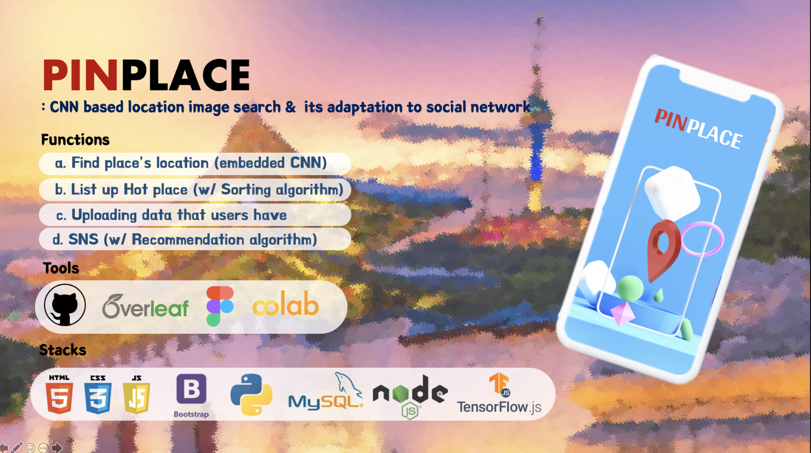

# SWE3028_Capstone Project_Team H

> Topic : CNN based Location Image Search and its Adaptation to Social Network, PINPLACE
>
>  Team Member : 엄지용, 이지섭, 정채원, 채승윤, 홍성준
> 

 

# PINPLACE
 
<h3>Summary</h3>

 
 

<h3> UI design </h3>
https://www.figma.com/file/kPRSZqt6wzZ49x4qpmfjma/캡스톤-UI?node-id=0%3A1
