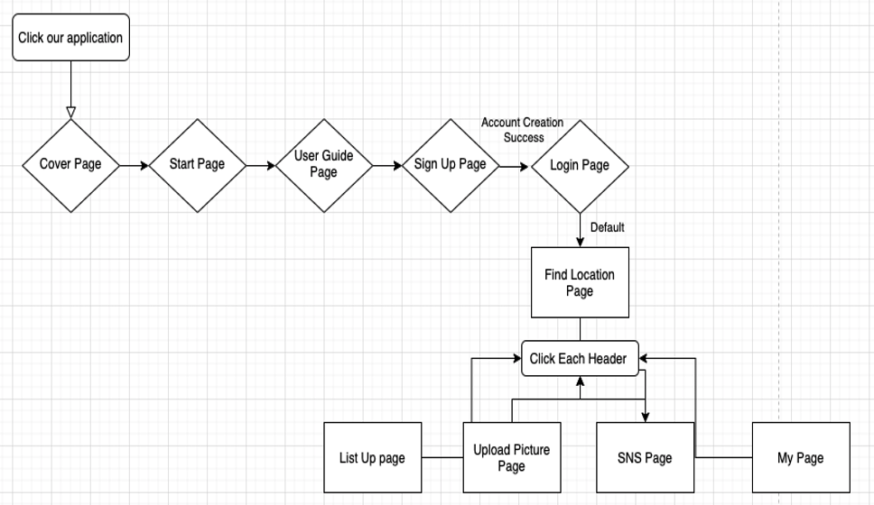

# SWE3028_Capstone Project_Team H

> Topic : CNN based Location Image Search and its Adaptation to Social Network, PINPLACE
>
> Team Member : 엄지용, 이지섭, 정채원, 채승윤, 홍성준
> 
> Repository Structure
> 

 

# Introudction of PINPLACE
<h3>0. Summary</h3>

 

<h3> 1. Objective </h3>
 “CNN based place recognition web app”
  
- 01. Service of place recognition feature & SNS feature.
  
- 02. Collect data set & Build CNN models which have the best accuracy
  
- 03. Work on UI design & graphic Design
  
- 04. Apply CNN models on web app
 

<h3> 2. Application's Structure </h3>
<h4> a. User Flow <h4>
 
 The following is a user flow diagram, which shows the connectivity and hierarchy between our web pages.
 

 
<h4> b. Page Lists (10 pages) <h4>

≪  Cover page / Start Page / User Guide Page / Signup Page / Login Page    
 / Find Location Page / List Up Page / Upload Picture Page / SNS Page / My Page  ≫ 

  
<h4> c. Description of each page  <h4>

PINPLACE Pages
	└a.coverpage: Since it is the first screen that users face, We designed the logo ourselves because we thought we had to firmly convey the platform brand image.
	└proposal.pdf
	└requirements.pdf
	└design_specification.pdf

	
a.	Cover page  
 Since it is the first screen that users face, We designed the logo ourselves because we thought we had to firmly convey the platform brand image.
 
o	Top Layer  
•	“PINPLACE” (Our platform’s name)  
o	Bottom Layer  
•	3d graphic assets (Represents our platform’s brand image)  
•	Include in “Onclick Function: that can move next page 
 
b.	Start Page  
 This page is expressed in fancy graphics to roughly imply the functionality of our platform 
	 
o	Top Layer  
•	3D Rotated Cube (with diverse place’s pictures)  
Implemented by setting x,y, z- axis angles with css  
o	Bottom Layer  
•	Start Button (with onclick function)  

c.	User Guide Page  
 For optimal UX, we made this page with Card UI. Every time user turn the page, the content and design are designed to be different.  
 
o	In card UI  
•	Put related graphics  
•	Put button below ‘PREV, NEXT, FINISH’  
-PREV : onclick function that move previous card  
-NEXT : onclick function that move next card  
-START: onclick function that connect sign up page  

d.	Sign Up Page  
 This page is for new users who want to make an account for this service. Currently this includes four text or password boxes, and a submission button.  

o	Submission form  
•	ID, nickname, and password  
•	Two password boxes that prevent mistakenly typed password  

e.	Login Page  
 To use the service, users need to sign in via this page. Among the information provided in the sign-up page, ID is unique for each user: thus, ID and password are needed to log in. Additionally, there is the button to the sign-up page for who doesn’t have an account for this service.  

o	Submission form  
•	ID and password  

f.	Find Location Page   
 This page is core function page. We connect with CNN model that we made ourselves.   

o	User flow  
•	Click Choose File button   
•	Put Input file (regardless of files’ extension)  
•	Click Predict Button  
•	Appear Output(location)  

g.	List Up page  
 This page shows the list of places serviced, by popularity. Popularity can be measured by daily, weekly, or monthly. Each place entry is clickable and shows a subpage for that place.  

o	Place list  
•	Shows top ten places; highlights top three  
•	Most recently uploaded photograph for each place  
o	Subpages  
•	Shows uploaded photographs by recency  

h.	Upload Picture Page  
 This page is prepared for improving AI model, so the location information for the picture is necessary. The dropdown list for locations needed is served.  

o	Submission form  
•	Upload button (shows preview after uploading)  
•	Dropdown list of locations  
•	Two buttons: Upload and Cancel  
o	After uploading  
•	A page saying “Thank you”  
•	The user can choose to upload more or to quit from this page  

 
i.	SNS Page  

o	Top Layer  
•	Develop Image Slider that place’s images are moved automatically  
o	Bottom Layer   
•	Posting function to recommend a location.  

j.	My Page  
This is the own user page for a user logged in, which shows pictures uploaded by that user from find location page. v

o	Layout  
•	Shows uploaded photographs by recency  
•	User’s nickname and profile photo  
 
 
	

# Output
<h3> 1. Inital UI design </h3>
https://www.figma.com/file/kPRSZqt6wzZ49x4qpmfjma/캡스톤-UI?node-id=0%3A1
 
